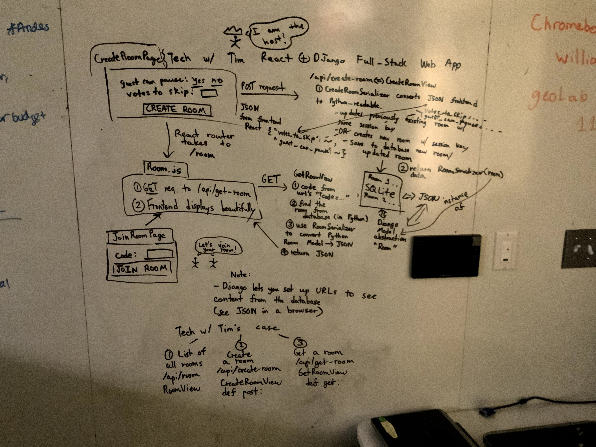

# React-Django-Tutorial

Following https://youtu.be/JD-age0BPVo playlist

## Tutorial One Commands

- Make folder called "React-Django-Tutorial"
- Install Python
- Install Prettier, Python, Django, React, JavaScript, and Kite extensions (not mentioned in tutorial, but noticed Tim used Kite) from VS Code.
- Type `pip` or `pip3` (depends on OS) on command line and see if it works out.
- `django-admin startapp frontend`
- `pip install django djangorestframework`
- `django-admin startproject music_controller`
- `cd music_controller`
- `django-admin startapp api`
- In `INSTALLED_APPS` in `music_controller/settings.py`, add:
- `'api.apps.ApiConfig'`
- `'rest_framework'`
- In `api` directory, create a `urls.py` to navigate the remaining URL (that were cut off in

## Tutorial One: Setup

- In Django, you have a project folder. We have apps within a single project.
- Don't worry about `migrations` folder in `api` folder
- In a Django app directory, that is where we have endpoints (e.g. domain.com/hi, domain.com/hello, etc.) be navigated to frontend view functions from `views.py`. A method has a `request` parameter.

## Tutorial Two: Django REST Framework (REST API)-API Endpoints-Database Model

- implemented [models.py](api/models.py), which sets up the fields to be displayed for creating new rooms
- implemented [serializers.py](api/serializers.py), which converts data types on the browser to JSON-data type
- implemented [views.py](api/views.py) to
- implemented [urls.py](api/urls.py) to display Room with `RoomView.as_view()`

## Tutorial 3: React Integration Using Webpack & Babel

- `django-admin startapp frontend`
- `cd frontend`
- created templates folder
- created static folder (anything that the broswer caches) with frontend, css, and images subfolders
- created src folder and components subfolder
- `npm init -y` to create node modules, package.json, and all the other things we need for our frontend project
- NPM transpiles our code and gets it ready to run in the browser (stores WebPack, React, etc.)
- `npm i webpack webpack-cli --save-dev`
- Babel allows us to transpile our code to render in older browsers.
- `npm i @babel/core babel-loader @babel/preset-env @babel/preset-react --save-dev`
- `npm i react react-dom --save-dev` for getting React
- `npm install @material-ui/core` is like Bootstrap
- `npm install @babel/plugin-proposal-class-properties` to `async` and `await` in our JavaScript code
- `npm install react-router-dom`
- `npm install @material-ui/icons`
- created `babel.config.json` presets the environment with node version 10 and `plugin-proposal-class-properties`
- created `webpack.config.js` to bundle up the code into `./static/frontend/main.js`, minimize for optimization
- added to `package.json`: dev and build scripts
- created `templates\frontend` directory to store `index.html`
- implemented `index.html`

### Changes to databases

- Do this also when initially creating your Django project.
- `python manage.py makemigrations`
- `python manage.py migrate`

### Django Projects

- `django-admin startapp [name of app]`
- `django-admin startproject [name of project`

# How to Run

`python manage.py runserver`

# File/Directory Structure

| File/Directory                                                         | Description                                                                                                                  |
| ---------------------------------------------------------------------- | ---------------------------------------------------------------------------------------------------------------------------- |
| [api](music_controller/api)                                            | Our database/model (class implementation in Django)/REST API.                                                                |
| [frontend](music_controller/frontend)                                  | React frontend to visually display our music controller app.                                                                 |
| [music_controller/music_controller](music_controller/music_controller) | Administers app as a whole (e.g. we include`INSTALLED_APPS` in [settings.py](music_controller/music_controller/settings.py)) |
| [frontend/static/frontend](music_controller/frontend/static/frontend)  | contains the bundle of all our JavaScript that actually runs the frontend (comes from source code)                           |
| [frontend/src/components](music_controller/frontend/src/components)    | contains React components, such as the HomePage, RoomJoinPage, etc.                                                          |

|

# Visual Diagram Explanation

